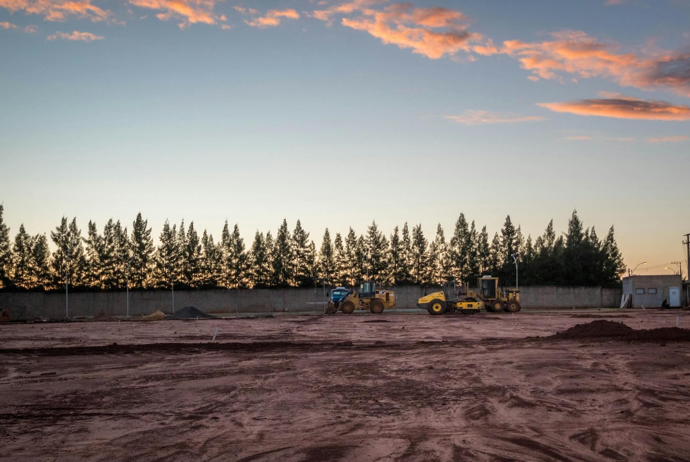

+++
title = "Starting up an Engineering Collaboration Project"
date = 2024-07-04
authors = [ {name = "OfficialKris", link = "https://github.com/OfficialKris", image = "https://github.com/OfficialKris.png"} ]
tags = ["Engineering", "Software", "Collaboration"]
excludeSearch = false
draft = true
+++

  
  
Photo by <a href="https://www.pexels.com/@victor-pace-2704890/">Victor Pace</a> from Pexels

Cross discipline collaboration is challenging. Many organizations have spent enormous resources trying to build out a digital asset management network <b><i>that just works</i></b>. These companies have tried everything from computer networked drives to efficient PDM software. But these solutions are not good enough. They are not <i>new</i>, <i>pleasant</i>, or even <i>enjoyable</i>. But if they are functional, why bother standing up a new project? Because, ultimately, the data created with these softwares does not belong to the person or entity who created them. You cannot inspect, transition or modify these files and, more importantly, projects without using these softwares. Unfortunately, that leaves me with little to no options as I begin growing my team and building my startup. So, is there any better way?

## The Reason

Again, unfortunately no. What little options exist are either unmaintained or lack the appeal of modern software engineering. This leaves two options-go with the "industry standard" and leave the data resiliency of my new startup in unknown hands or do something big: build an enterprise grade engineering collaboration software package.

Of course, I do not intend to built this from scratch. Instead, I will be relying on open source tools and projects. This solution lets me maintain data ownership and, more importantly, seamlessly integrate with custom tooling to build an amazing user experience. My goal is to <i><b>not</i></b> commercialize this software. Therefore, this software will be open sourced (Apache 2.0 License) and remain free to use, forever.

The most important aspect of team collaboration is sharing and remixing. Therefore, a primary concern of this new platform will be bringing shared engineering content to the 21st century. Building off the amazing software listed in the next section, this platform will be robust, resilient and durable. This will enable an entire new world of possibilities.

## The Software

More important then the software I write, is the software I use:

- [Git SCM](https://git-scm.com/)
- [KiCad](https://kicad.org/)
- [FreeCAD](https://freecad.org/)

These three softwares are the foundation of the new platform called Ki365-a single source of truth for authoring owned engineering data.

## What Can be Done?

We can forge the next generation of engineering collaboration through modern computer networked software. A key aspect of engineering is sharing and we can take that into the 21st century through <i><b>federation</i></b> which essentially means distributed computer networks. By using the [AT Protocol](https://bsky.social/about/blog/10-18-2022-the-at-protocol) built by social media platform [Bluesky](https://bsky.social/), we will be able to build an interconnected engingineering platform built to scale. See the following diagram:

[INSERT DIAGRAM]

This system builds upon giants. Decentralized engineering. The technology stack is incredible, perforant, reliable, and and awesome to use.

The current state of Ki365 includes most of the foundational pieces. However, I will not start accepting any potential PR requests until a v0.0.1 or our Minimal Viable Product (MVP) release. This release will signify a baseline of usability (add a project, view a project, project structure stable).

These three pieces of software are the user facing programs in the program called Ki365 (provide link). These softwares make Ki365 worthwhile. I have used KiCad for professional level projects and am blown away by the value provided. FreeCAD, although as of writing this, not yet at version 1.0 (refering to "ready to use in production", although rapidly approaching (hopefully the end of this month) provides an incredible data format openness (in contrast to the rest of the industry). And Git. What more do I have to say? This software is the leader in Version Control Systems (VCS) and underpins the entire software economy.

In traditional engineering (cars, spacecraft, tanks), engineering documents are pushed to a centralized repository with a dedicated staff performing critical maintence (archives, updates, security). However, I believe there is a segment of the engineering community which wants an easy to use platform for managing their content. But how could this happen?

## Towards The Future!

Looking forwards, I will be building towards an initial usable version (V0.0.1) with the following support:

- Project management
- Project views
- Access control
- Initial documentation (this site)

Beyond that, the following features will be included as part of a initial stable release (V1):

- Federation (shared projects, components, posts)
- Project releases (git tags)
- FreeCAD integration
- Binary diff merge
- Component authority (parts, footprints, symbols, components)
- and hopefully much more!

However, Ki365 is not there yet. In fact, as of writing this post, I have only just pushed changes moving the eye candy project listing from an internal, fixed, json mapping to a dynamically generated REST API call. That took over 24hrs of work (including going from implementing React promises with toasting support to building the golang API function performing the zipped project files extraction and validation).

## A New Problem

To build this platform requires lots of quality and useful software. Much has been built over the past few decades, but not the glue-Ki365. Even though I have been up to this point, I cannot build all of Ki365. This project should be built by the community for the community. I ask if Ki365 is useful to you or your organization, please consider contributing!

Ki365 can be the definitive place for engineering collaboration. We just need to build it!
